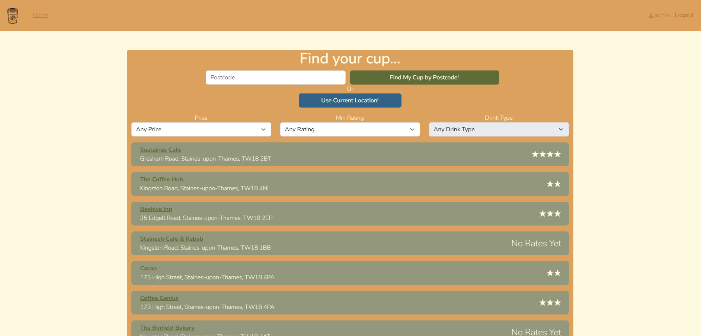

## RateMyCup (Capstone Project)

***Application can be visited online at:*** https://rate-my-cup-capstone.onrender.com
*(Allow some time for searching as backend hosting is quite slow on free tier)* 

RateMyCup is a web application for users to find and recommend places to get access to the best coffee in their area. They are able to search by location, price point and quality to navigate user reviews of different types of drink.

It can be difficult if you are in a place you do not know well, and want to get a cup of coffee you know is going to be worth the money you spend, so the purpose of the app is to take the risk away and ensure you are going to enjoy the coffee you get. It is for any coffee-lovers who also want to share their recommendations with other people!

#### Architecture:

The front-end of this app was built using React and JavaScript, as this was the framework I had most experience with and wanted to build on my experience with. The backend was built using Node.js & Express, with a MongoDB hosted on Atlas. This worked well for storing and managing user and review data, and handling HTTP requests to view, add and update reviews.

For the coffee shop data, I used the free TomTom Search API to make calls for both finding all coffee shops near a location and for getting specific data on a coffee shop (address, opening hours etc). This worked mostly well, although there were some inconsistencies about the way the API worked to handle chain coffee shops and some issues with categorisation (for example, Pret is listed as a restaurant rather than coffee shop so doesn't show up in search).

#### Design:

This is the page that displays when a user first visits the app:

And then, following a search, a list of coffee shops closest to the location provided (either a postcode or retrieved from the browser):

Users can then filter the results by certain drink type, rating and price level:

This is the detail page for a specific coffee shop:

Users can leave new reviews on this page:

#### Future Development:

I am pleased with the app at the moment but there are many more features I would like to implement over time:

* Option for users and admins to delete Rates
* More app navigation options - search for specific coffee shop by name
* Interactive map with pins as alternative to list search
* Better handling for drink specifics, including iced drinks, alternative milks etc