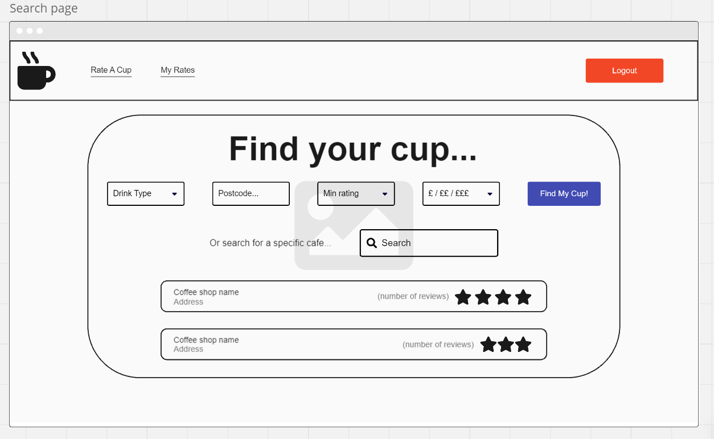
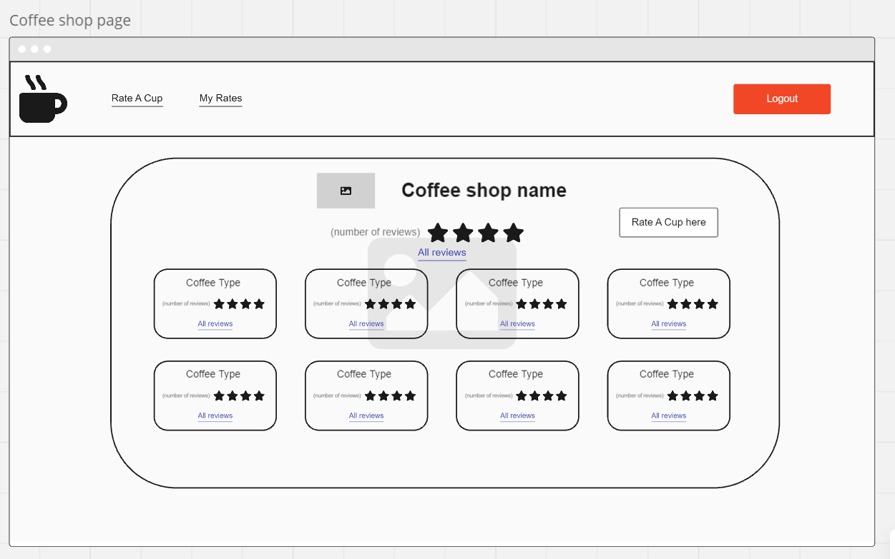
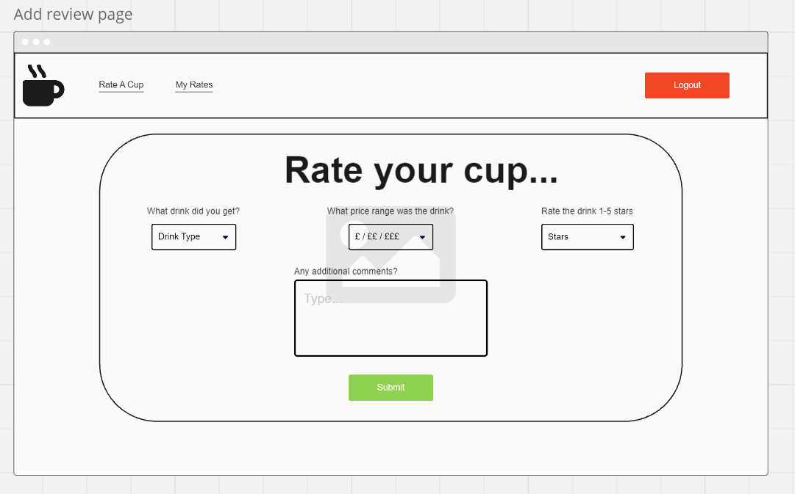
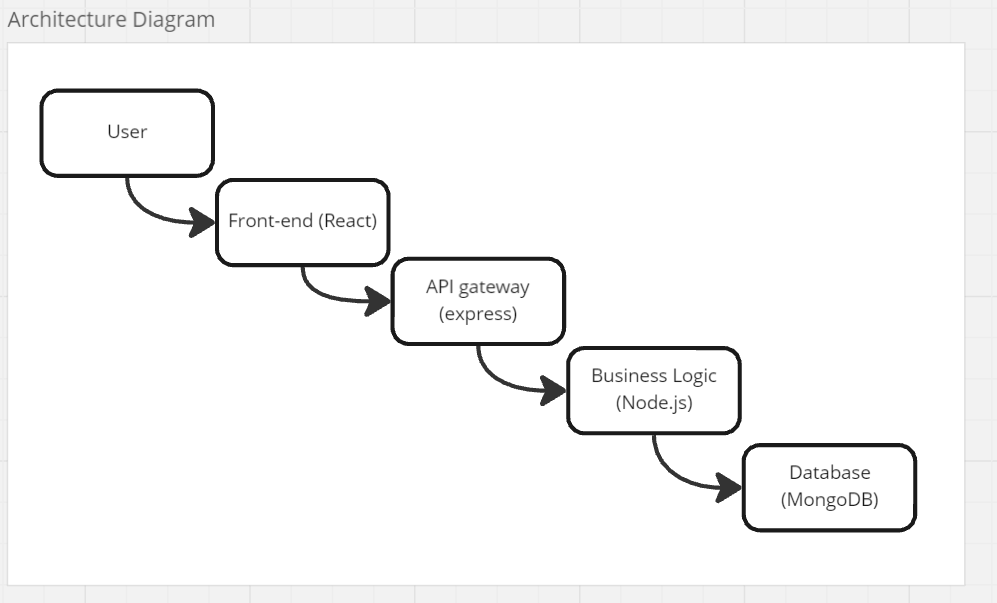

# Capstone Project Proposal

## Rate My Cup 

RateMyCup is a web application for users to find and recommend places to get access to the best coffee in their area. They will be able to search by location, price point and quality to navigate user reviews of different types of drink.

### Context 

It can be difficult if you are in a place you do not know well, and want to get a cup of coffee you know is going to be worth the money you spend, so the purpose of the app is to take the risk away and ensure you are going to enjoy the coffee you get. It will be for any coffee-lovers who also want to share their recommendations with other people!

### Features

* List of coffee shops closest to you is default, with general details of coffee shop
* Choosing a specific shop shows full details of user reviews by drink
* Users can also search by filters such as price, minimum rating (either by specific drink or overall) as well as by location proximity
* Add review of coffee, recording type of coffee, 1-5 stars, price, and any general comments
* Admins can edit and delete any reviews they see fit
* Users can edit and delete only their own reviews
* If time allows, there will also be a map displaying pins of the coffee shops and their scores

### User interface

### Architecture
**Front-end:**
React - will have components for registration & login screens, as well as search page, add/edit user reviews, and admin panel for admins. Will make HTTP request to back-end
**Back-end:**
Node.js/Express - handles CRUD requests for users, reviews and coffee shops. Also handles authentication of users, and handles search requests with different filters
**Database:**
MongoDB - will have separate collections for user, reviews and coffee shops

### RESTful Routing

**Users:**
POST "users/register"
Request: {email, password}
Response: {user}

POST "users/login"
Request: {email, password}
Response: {role, id, token}

GET "users/:id"
Request: {token (header) , id (request params)}
Response: {user}

PUT "users/:id"
Request: {token (header) , id (request params), updated details}
Response {user}

DELETE "users/:id"
Request: {token (header) , id (request params)}
Response: {user}

**Reviews:**
GET "reviews"
Request : {query parameters for filter}
Response: array of reviews

POST "reviews"
Request: {token, review details (type, rating, price, comments)}
Response: new review object

PUT "reviews/:id"
Request: {token, id, updated review details (type, rating, price, comments)}
Response: updated review object

DELETE
Request: {token, id}
Response: success message

**Coffee shops:**

GET "coffee-shops"
Request: no headers or payload required
Response: array of coffee shops with general details

GET "coffee-shops/:id
Request: {id from parameters}
Response: coffee shop object with full details and reviews

### Technologies

Front-end: React, HTML, CSS, JavaScript
Back-end: Node.js, Express
Database: MongoDB
Authentication: JWT
Dependencies: Axios, Mongoose, bcrypt
Testing: vitest, mocha, chai, react-testing-library

External API calls:
Trustpilot Categories API for all coffee shops
Trustpilot Business Unit company logo for specific coffee shops

### Deployment

Front-end: Netlify
Back-end: Render
Database: Mongo Atlas